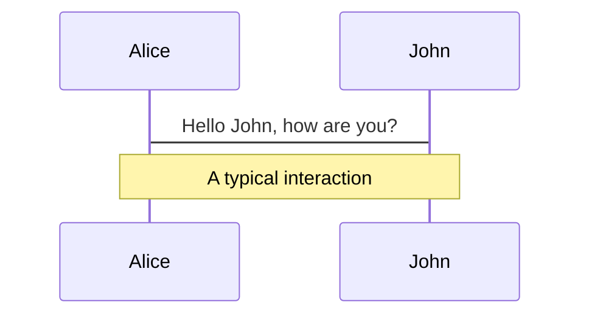
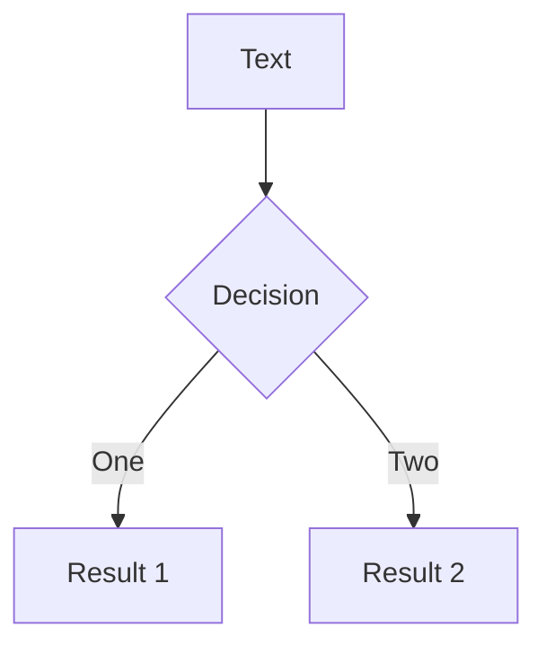
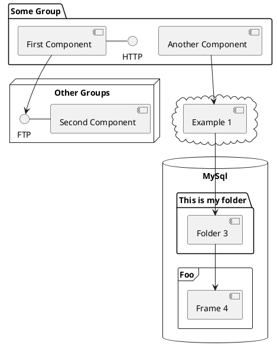

# <span class="text-[#ffd700]">Interactive web apps with Vue</span>

Wisemen

---

# Korte inhoud


- **Tools** - Welke tools gaan we gebruiken
- **Project setup** - Hoe een project op te zetten
- **Folder structure** -  Folder structuur van een project
- **Vue syntax** - Hoe ziet een Vue file eruit
- **Nuttige packages** - Hoe ziet een Vue file eruit
- **Tailwind / windicss** - Hoe werkt tailwind
- **Wat gaan we maken** - Wat is het doel van deze les
- **API uitleg** - Hoe werkt de API die we gaan gebruiken

---
layout: image-right
image: https://miro.medium.com/max/1400/0*W06-5WbBC9aEKDVT
---

# Tools

## Visual studio code

<br/>

### Plugins

<br/>

- **Volar** - Fast Vue Language Support Extension
- **ESLint** - Code formatter / Regels
- **WindiCSS IntelliSense** - IntelliSense voor WindiCSS

---
layout: image-right
image: https://source.unsplash.com/collection/94734566/1920x1080
---

# Project Setup

[Vue Docs](https://vuejs.org/guide/quick-start.html#with-build-tools)

Simpele tutorial

### Skeleton project
[https://github.com/Robbe95/vue-skeleton](https://github.com/Robbe95/vue-skeleton)

```cmd {1|2|3|all}
npx degit Robbe95/vue-skeleton my-project-name
cd my-project-name
npm i
```

---

# Project structure

- **Assets** - Alle images / icons / assets
- **Components** - Vue components
- **Composables** -  Reusable Vue code snippets
- **Layouts** - Layouts van verschillende pagina's
- **Locales** - I18n files / Vertalingen
- **Pages** - Vue pagina's
- **Router** - Router files
- **Services** - API calls
- **Stores** - State managment
- **Types** - Typescript types

---
class: px-20
---

# Vue Syntax

### SFC - Single file components

- **Script** - Javascript / Typescript
- **Template** - HTML met Vue directives
- **Style** - CSS

---

# Script

## Composition API

```javascript
<script setup>
</script>
```

## Options API
```javascript
export default {
  data() {
    return {
      name: 'John',
    };
  },
  methods: {
    doIt() {
      console.log(`Hello ${this.name}`);
    },
  },
  mounted() {
    this.doIt();
  },
};
```

---

# Composition API


---

# Diagrams

You can create diagrams / graphs from textual descriptions, directly in your Markdown.

<div class="grid grid-cols-3 gap-10 pt-4 -mb-6">







</div>

[Learn More](https://sli.dev/guide/syntax.html#diagrams)


---
layout: center
class: text-center
---

# Learn More

[Documentations](https://sli.dev) · [GitHub](https://github.com/slidevjs/slidev) · [Showcases](https://sli.dev/showcases.html)
